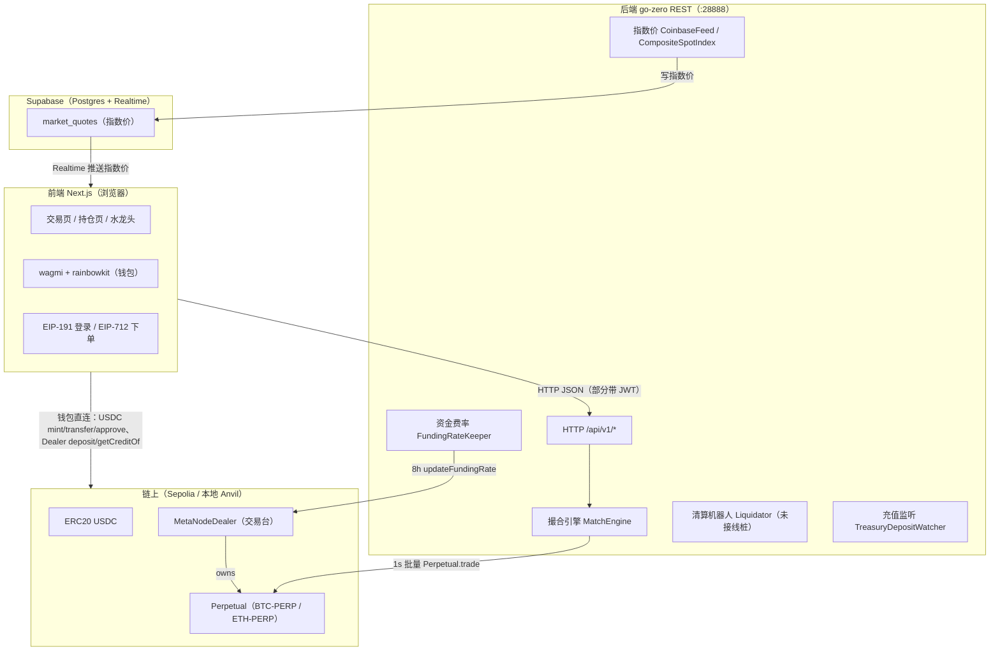
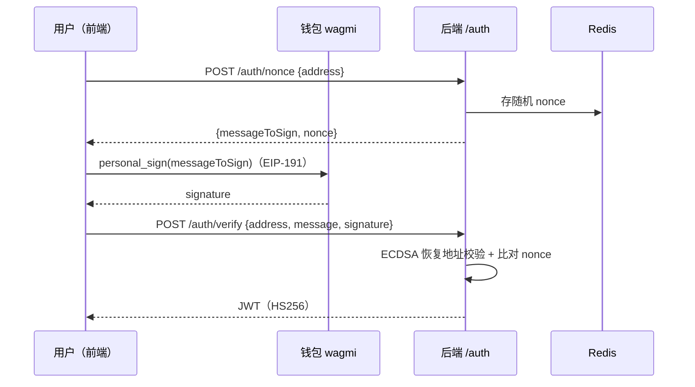
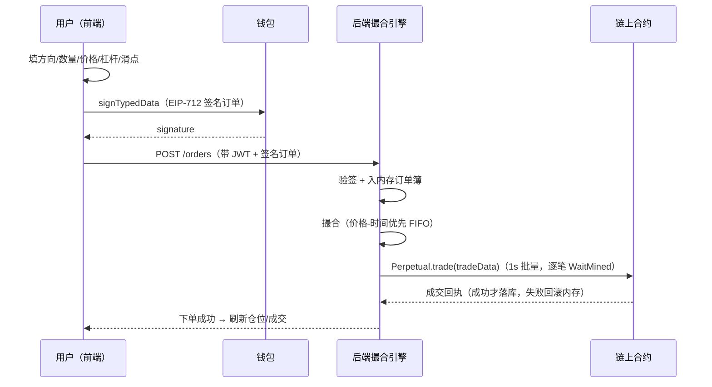
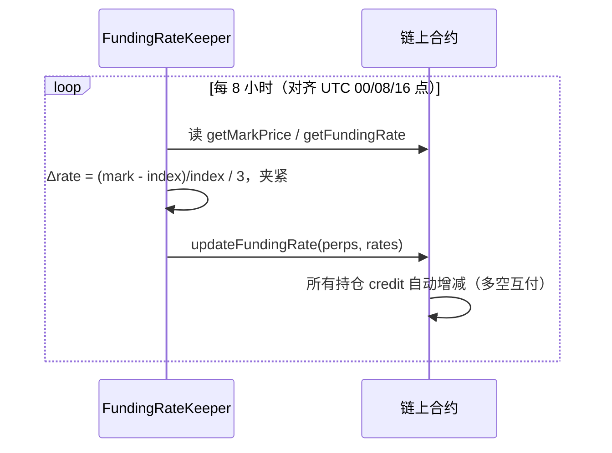
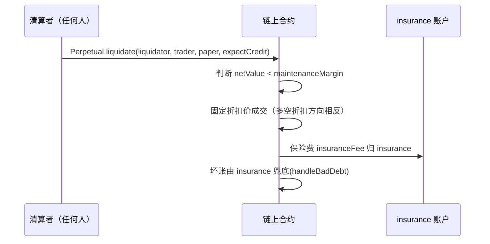
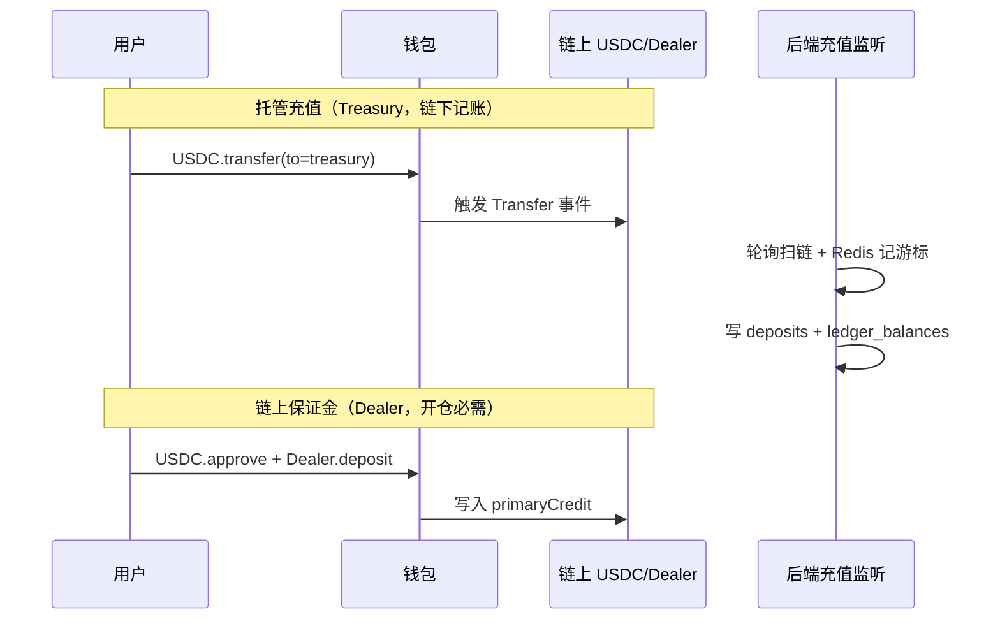

# MetaNode 架构与流程说明

> 一份面向「快速理解整套 Web3 项目」的中文导读：它是什么、用户怎么玩、前端/后端/合约三端如何流转、各角色在流程中的位置。
>
> 代码位置：合约 `perpetual-contract/`（Foundry）、后端 `perp-backend/` 与 `perpetual-contract/others/backend/`（go-zero）、前端 `perpetual-contract/others/fe/`（Next.js）。

---

## 1. 项目一句话概览

MetaNode 是一个**去中心化永续合约交易系统**（教学项目），核心模型是：

> **链下撮合、链上结算** —— 用户用 EIP-712 签名订单，relayer（撮合引擎）在内存里撮合，只有撮合成功的 `trade()` 才上链结算。

交易标的为 BTC-PERP / ETH-PERP 等永续合约，锚定外部现货指数价（Coinbase / Chainlink），通过**资金费率**让合约价贴近现货价。

---

## 2. 整体架构图

三端 + 两类外部依赖（链上合约、Supabase）：

```
                          ┌──────────────────────────────────────────────┐
                          │              链上 (Sepolia / 本地 Anvil)        │
                          │  ┌───────────────┐   ┌──────────────────────┐ │
                          │  │  ERC20 USDC    │   │ MetaNodeDealer(交易台)│ │
                          │  │  mint/transfer │   │  ├ setOrderSender…   │ │
                          │  │  approve       │   │  ├ updateFundingRate │ │
                          │  └───────▲───────┘   │  └── owns N × ──────┐ │ │
                          │          │ transfer/ │                      │ │ │
                          │          │ approve   │  ┌──────────────────▼─┐│ │
                          │          │           │  │ Perpetual (BTC-PERP)││ │
                          │          │           │  │ Perpetual (ETH-PERP)││ │
                          │          │           │  │  trade / liquidate  ││ │
                          │          │           │  └────────────────────┘│ │
                          │          │           └────────────────────────┘ │
                          └──────────┼──────────────────────────────────────┘
                                     │
        ┌────────────────────────────┼──────────────────────────────────────┐
        │  后端 (go-zero REST, :28888) │                                      │
        │  ┌────────── HTTP /api/v1/* ────────────────┐                     │
        │  │  撮合引擎 MatchEngine ──1s──► Perpetual.trade (链上结算)         │
        │  │  资金费率 FundingRateKeeper ─8h─► updateFundingRate             │
        │  │  清算机器人 Liquidator (未接线桩)                                 │
        │  │  充值监听 TreasuryDepositWatcher ──扫 USDC Transfer──► 记账      │
        │  │  指数价 CoinbaseFeed / CompositeSpotIndex                       │
        │  └──────────────────────────────────────────────────────────────────┤
        │  数据库: Supabase Postgres (GORM) + Redis(游标/锁)                   │
        └──────────────────────────┬──────────────────────────────────────────┘
                                   │ HTTP JSON (部分带 JWT Bearer)
                          ┌────────▼───────────────────────┐
                          │  前端 Next.js (浏览器)            │
                          │  交易页 / 持仓页 / 水龙头          │
                          │  wagmi + rainbowkit (钱包)        │
                          │  EIP-191 登录 / EIP-712 下单      │
                          └───────┬──────────────────────────┘
                                  │ 直读直写链上(不经过后端)
                                  │  USDC balanceOf/approve/transfer/deposit
                                  │  Dealer getCreditOf / deposit
                                  ▼
                          ┌──────────────────────────────────┐
                          │ Supabase Realtime (market_quotes) │
                          │  只推送「指数价」，供前端实时显示     │
                          └──────────────────────────────────┘
```

三条数据通路：

1. **前端 → 后端**：HTTP JSON（行情/订单/仓位/余额/登录），敏感接口带 JWT。
2. **后端 → 合约**：后端用配置私钥（`validOrderSender`/`fundingRateKeeper`）发链上交易，只写 `Perpetual.trade` 和 `Dealer.updateFundingRate` 两个函数，其余全是 view 查询。
3. **前端 → 合约**：钱包直连 RPC，做 `USDC.mint/transfer/approve`、`Dealer.deposit/getCreditOf` 等（不经后端）。

---

## 3. 角色与权限

| 角色 | 定义/存储 | 谁设置 | 权限 / 用途 |
|---|---|---|---|
| **owner（管理员）** | OZ `Ownable`（部署者） | 部署者 | 所有 `onlyOwner` 管理函数（设角色、注册市场、设风险参数等） |
| **fundingRateKeeper** | `state.fundingRateKeeper` | owner | 唯一能调 `updateFundingRate`（资金费率更新者，通常就是后端） |
| **orderSender（relayer/撮合引擎）** | `state.validOrderSender` | owner | 唯一能作为 `approveTrade` 的发送方；收取全部交易手续费 |
| **insurance（保险账户）** | `state.insurance` | owner | 被动账户：收清算保险费、兜底坏账 |
| **operator（交易操作员）** | `operatorRegistry[client][op]` | 用户本人 | 代客户签单、代清算者执行清算（无资金权限） |
| **fundOperator（资金操作员）** | `primary/secondaryCreditAllowed` | 用户本人 | 额度内代用户取款 |
| **liquidator（清算者）** | 无注册 | 任何人 | 任何人可调 `Perpetual.liquidate`；禁止自清算 |
| **subaccount（子账户）** | `Subaccount.owner` | 用户 `newSubaccount()` | 独立合约，owner 可 `execute` 任意调用，用于风险隔离/量化委托 |

owner 专属管理函数（`MetaNodeOperation.sol`，全部 `onlyOwner`）：`setPerpRiskParams`、`setFundingRateKeeper`、`setInsurance`、`setOrderSender`、`setFastWithdrawalWhitelist`、`setWithdrawlWhitelist`、`setWithdrawTimeLock`、`setMaxPositionAmount`、`disableFastWithdraw`、`setSecondaryAsset`。

两个权限修饰符（`MetaNodeStorage.sol`）：`onlyFundingRateKeeper`、`onlyRegisteredPerp`。

---

## 4. 三条链路流转

### 4.1 前端 → 后端（HTTP）

统一前缀 `/api/v1`，请求封装在 `fe/lib/metanode-api.ts`。**鉴权**：登录拿 JWT 后自动加 `Authorization: Bearer`。

| 接口 | 鉴权 | 用途 | 前端调用点 |
|---|---|---|---|
| POST `/auth/nonce` | 否 | 拿登录 nonce + 待签消息 | `WalletAuthSync.tsx` |
| POST `/auth/verify` | 否 | 验签返回 JWT | `WalletAuthSync.tsx` |
| GET `/markets` | 否 | 市场列表/标记价/资金费率 | 交易页 30s 轮询 |
| GET `/klines` | 否 | K 线 | 切换周期 |
| GET `/orderbook` | 否 | 深度 | 5s 轮询 |
| GET `/trades` | 否 | 最新成交 | 5s 轮询 |
| GET `/open-quote` | 否 | 开仓系统价 | 下单表单 |
| GET `/order-preview` | 否 | 下单前滑点/深度模拟 | 下单表单（防抖） |
| GET `/funding-rate/latest` | 否 | 资金费率 + 倒计时 | 资金费率面板 |
| GET `/balance` | 是 | 账户余额 | 我的账户 |
| GET `/deposits` | 是 | 充值记录 | 我的账户 |
| GET `/positions` | 是 | 持仓 | 持仓页 15s 轮询 |
| GET `/risk` | 是 | 风险信息 | 持仓页 |
| POST `/orders` | 是 | 提交签名订单 | `OrderForm.tsx` |

**实时性**：只有指数价走 Supabase Realtime；其余全部 HTTP 轮询（5s / 15s / 30s），无订单流 WebSocket。

### 4.2 后端 → 合约（chain.Client）

后端用 `Ethereum.PrivateKey` 发交易。**只封装了两个写方法**：

| Go 方法 | 合约函数 | 说明 |
|---|---|---|
| `SubmitPerpTrade` | `Perpetual.trade(tradeData)` | 撮合成交上链；发送者须是 `validOrderSender` |
| `SubmitFundingRateUpdate` | `Dealer.updateFundingRate(perpList, rateList)` | 资金费结算；发送者须是 `fundingRateKeeper` |

其余是只读查询（对应合约 view）：`GetMarkPrice`/`GetFundingRate`/`GetRiskParams`/`GetCreditOf`/`GetTraderRisk`/`GetPositions`/`GetLiquidationPrice`/`IsSafe`/`BalanceOf`/`IsOrderSenderValid`/`FilterUsdcTransfersTo`。

> 注意：`Client` **没有**封装 `liquidate`（清算机器人是桩），也没有 `deposit/withdraw`（充值走链下监听、入金走 USDC 转账扫描）。

### 4.3 前端 → 合约（直连）

钱包直读直写，不经后端：

- **读**：`USDC.balanceOf/decimals`、`Dealer.getCreditOf`（判断保证金是否够）。
- **写**：
  - 水龙头：`USDC.mint`。
  - Treasury 充值：`USDC.transfer(to=treasury)`。
  - Dealer 保证金：`USDC.approve` + `Dealer.deposit(amount, 0, to)`。

---

## 5. 用户怎么玩（操作流程）

### 5.1 连接钱包 + 登录（EIP-191）

1. 前端 rainbowkit 连接钱包（Sepolia）。
2. `POST /auth/nonce` → 后端生成随机 nonce 存 Redis，返回 `messageToSign = "Sign in to MetaNode.\n\nWallet: {address}\nNonce: {nonce}"`。
3. 钱包 `personal_sign`（**EIP-191**，不是 EIP-712）对消息签名。
4. `POST /auth/verify` → 后端用 `accounts.TextHash` 恢复地址校验，签发 HS256 JWT。
5. 前端存 localStorage，后续请求带 Bearer 头。

### 5.2 充值（双轨，记账分离）

- **托管充值（Treasury）**：`USDC.transfer(to=treasury)`，后端 `TreasuryDepositWatcher` 扫链入账 `deposits` + `ledger_balances`（链下余额）。
- **链上保证金（Dealer）**：`USDC.approve` + `Dealer.deposit`，写入合约 `primaryCredit`（**开仓必需**）。

### 5.3 下单（EIP-712）

1. 用户在 `OrderForm` 填方向/数量/价格/杠杆/滑点，点「买进/卖出」。
2. 前端构造订单：`paper = ±size`，`credit = ∓notional`；手续费、过期时间、nonce 打包进 `info`。
3. EIP-712 签名（domain `{name:"MetaNode", version:"1", chainId:11155111, verifyingContract:Dealer}`）。
4. `POST /orders` → 后端验签 → 订单入内存订单簿。
5. 撮合引擎撮合 → 1s 批量上链 `Perpetual.trade` → 成功落库，失败回滚内存簿。

### 5.4 平仓 / 看仓位

- **平仓**：持仓反向生成订单，复用下单流程。
- **看仓位/风险**：`GET /positions` + `GET /risk`，15s 轮询。

---

## 6. 系统后台流转（长驻引擎）

`metanode.go` 启动顺序：ServiceContext → ChainClient（校验 orderSender）→ 充值监听 → 指数价源 → 撮合引擎 → 清算机器人 → 资金费率 → HTTP 服务。

| 引擎 | 周期 | 职责 |
|---|---|---|
| **MatchEngine（撮合）** | 事件驱动 + 100ms ticker + 1s 提交 | 内存订单簿价格-时间优先撮合，撮合结果逐笔上链 |
| **FundingRateKeeper** | 8h（对齐 UTC 00/08/16 点） | 算资金费率并批量 `updateFundingRate` |
| **Liquidator** | `CheckInterval` | 检查不安全仓位并清算（**当前未接线桩**） |
| **TreasuryDepositWatcher** | 12s 轮询 | 扫 USDC Transfer 入账，Redis 记游标 |
| **CoinbaseFeed / CompositeSpotIndex** | WS 实时 | 指数价 → Supabase `market_quotes` |

---

## 7. 四大链上流程

### 7.1 交易（trade / approveTrade）

```
orderSender → Perpetual.trade(tradeData)          [Perpetual.sol:140]
              → Dealer.approveTrade(msg.sender, data)   [MetaNodeExternal.sol:197]
                ├ 校验 onlyRegisteredPerp + validOrderSender
                ├ abi.decode → (Order[], bytes[], uint256[])
                ├ 逐个订单 EIP-712 验签 / 过期 / 异号 / 防自成交 / 不超额
                ├ Trading._matchOrders → paper/credit 结算 + 手续费
                └ 手续费全归 orderSender
              → Perpetual._settle 写入双方余额 → require(isAllSafe)
```

**余额模型**：`credit = paper * fundingRate + reducedCredit`。只有三种操作改余额：**资金费 / 交易 / 清算**。

### 7.2 资金费率（updateFundingRate）

```
fundingRateKeeper → Dealer.updateFundingRate(perpList, rateList)  [onlyFundingRateKeeper]
                   → Perpetual.updateFundingRate(rate)  [onlyOwner=Dealer]
```

`fundingRate` 是**累计值**，只有增量有意义。keeper 每 8h 算 `Δrate = (mark - index)/index / 3`（夹紧后）累加；更新后所有持仓者 `credit` 自动增减（多头付空头 / 空头付多头），无需逐户写存储。

### 7.3 清算（liquidate）

```
任意 liquidator → Perpetual.liquidate(liquidator, trader, requestPaper, expectCredit)
                 → Dealer.requestLiquidation → Liquidation.requestLiquidation
                   ├ 触发条件: netValue < maintenanceMargin（低于维持保证金）
                   ├ 固定折扣价成交: 清算多头 price = mark×(1-折扣)；空头 = mark×(1+折扣)
                   ├ 保险费 insuranceFee 归 insurance 账户
                   └ 坏账由 insurance 兜底(handleBadDebt)
```

### 7.4 存取款（deposit / withdraw / fastWithdraw）

- **存款**：`approve` 后 `Dealer.deposit(primary, secondary, to)`。
- **普通取款**（两步 + 时间锁）：`requestWithdraw` 记 pending + 时间锁 → 到期后 `executeWithdraw`。
- **快速取款**（一步）：`fastWithdraw`，`fastWithdrawDisabled` 时仅白名单可用。

---

## 8. 关键结论 / 注意点

1. **`trade` 不在 Dealer**：真正的成交入口是 `Perpetual.trade`，它回调 `Dealer.approveTrade`；调用 `trade` 的 `msg.sender` 就是 orderSender，必须已加入 `validOrderSender` 白名单。
2. **登录是 EIP-191，下单才是 EIP-712** —— 别混淆。
3. **订单 `nonce` 字段未实现**：`Types.sol` 注释声明了 nonce，但无解析函数，实际防重放仅靠累计成交量检查。
4. **清算机器人是未接线的桩**：`isSafe` 恒返回 true、`traders` 列表为空、链上 `liquidate` 未实现（后端待补）。
5. **后端有两份拷贝**：`perp-backend/`（快照）与 `perpetual-contract/others/backend/`（更完整，含 funding/market/orderbook/fillsim 等）。改后端前先确认权威版本。
6. **前端遗留代码**：`lib/api.ts`（Orderly 公共行情）、`TopBar.tsx`、`MarketSelector.tsx`、`fetchMetanodeOrders` 已定义但未被使用。
7. **风险参数约束**：`liquidationPriceOff + insuranceFeeRate <= liquidationThreshold`，保证折扣 + 保险费不超过清算阈值。

---

## 附录：Mermaid 图（GitHub 可渲染）

### A1. 整体架构



### A2. 登录流程（EIP-191）



### A3. 下单 → 撮合 → 上链（EIP-712）



### A4. 资金费率结算（8h）



### A5. 清算流程



### A6. 充值流程（双轨）


